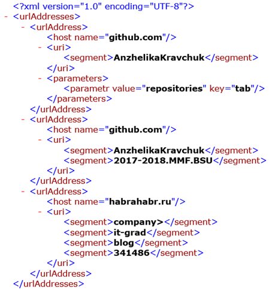

1. `URL: text to XML.`

    - A text file line by line stores URLs by pattern <scheme>://<host>/<URL-path>?<parameters> . <parameters> are key=value pairs. <URL-path> and <parameters> or only <parameters> may be missing.
    - Create a type system (based on SOLID principles) for exporting data obtained from parsing a text file into an XML document. For example, a text file with URLs
    
          https://github.com/AnzhelikaKravchuk?tab=repositories
          https://github.com/AnzhelikaKravchuk/2017-2018.MMF.BSU
          https://habrahabr.ru/company/it-grad/blog/341486/
        
        turns into an XML
        
        

    - Use any XML technology without restrictions.
    - For URLs that do not match this pattern, log the information, marking the indicated lines as unprocessed.
    - Demonstrate the result as a console application.
